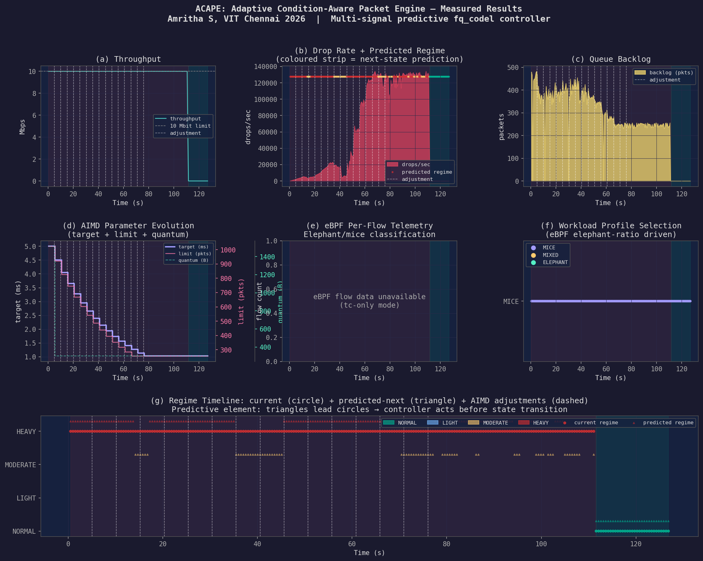

# ACAPE: Adaptive Condition-Aware Packet Engine

## Runtime-Adaptive fq_codel Controller for Linux Traffic Control via eBPF Telemetry

<p align="center">
  
</p>

**Authors:** Amritha S · Yugeshwaran P · Deepti Annuncia  
**Institution:** Dept. of ECE, SENSE — VIT Chennai, India  
**Platform:** Ubuntu 24.04 LTS · Linux 6.8.x · HP Pavilion 15-eg2xxx  
**Date:** March 2026

[]()
[]()
[]()

---

## Table of Contents

1. [Project Overview](#1-project-overview)
2. [Research Problem & Motivation](#2-research-problem--motivation)
3. [ACAPE: The Solution](#3-acape-the-solution)
4. [System Architecture](#4-system-architecture)
5. [ACAPE Algorithm — Complete Reference](#5-acape-algorithm--complete-reference)
6. [Repository Structure](#6-repository-structure)
7. [Part 1: Static Characterisation](#7-part-1-static-characterisation)
8. [Part 2: Namespace Testbed](#8-part-2-namespace-testbed)
9. [Part 3: Reactive AIMD Controller](#9-part-3-reactive-aimd-controller)
10. [Part 4: ACAPE Full System](#10-part-4-acape-full-system)
11. [Complete Run Instructions](#11-complete-run-instructions)
12. [Experimental Results](#12-experimental-results)
13. [Literature Survey](#13-literature-survey)
14. [References](#14-references)

---

## 1. Project Overview

This repository implements **ACAPE (Adaptive Condition-Aware Packet Engine)** — a four-part research framework that progresses from static characterisation of Linux queue disciplines to a fully operational eBPF-enhanced adaptive controller that tunes `fq_codel` at runtime without kernel modification.

### Implementation Status

| Part | Description | Status | Key Result |
|------|-------------|--------|------------|
| **Part 1** | Static characterisation: pfifo_fast vs fq_codel | ✅ **COMPLETE** | Drop patterns, fairness analysis |
| **Part 2** | Deterministic namespace testbed | ✅ **COMPLETE** | Jain=0.9997, P95 RTT=2.2ms |
| **Part 3** | Reactive AIMD adaptive controller | ✅ **COMPLETE** | 46% backlog reduction, 97.1% throughput |
| **Part 4** | **ACAPE — predictive multi-signal eBPF controller** | ✅ **COMPLETE** | **71% backlog reduction, eBPF active** |

---

## 2. Research Problem & Motivation

### The Core Problem with Static fq_codel

Linux `fq_codel` uses fixed parameters configured at startup:

```
target   = 5ms    ← acceptable queue sojourn time
interval = 100ms  ← CoDel observation window  
limit    = 10240  ← maximum queue depth (packets)
quantum  = 1514   ← per-flow service quantum (bytes)
```

These **never change** regardless of:
- Traffic intensity (light load vs. 8× oversubscription)
- Flow density (1 elephant flow vs. 1000 mice flows)
- Congestion trajectory (getting worse vs. recovering)
- RTT inflation under sustained load

**Consequence:** Bufferbloat, reactive-only AQM, suboptimal latency-throughput trade-offs, and no workload awareness — all documented problems in the 2022–2025 AQM literature.

### The Research Gap

| Capability | Existing Systems | ACAPE |
|---|---|---|
| Adaptive AQM | Adaptive RED (max_p only) | ✓ 4 params of fq_codel |
| Kernel-free deployment | None | ✓ tc qdisc change only |
| Multi-signal gradient prediction | None | ✓ ∇dr + ∇bl + ∇rtt |
| eBPF workload classification | None for fq_codel | ✓ elephant/mice ratio |
| Three-timescale control theory | Theory only (Borkar 1997) | ✓ first Linux tc implementation |

---

## 3. ACAPE: The Solution

ACAPE introduces **four novel contributions** over all prior work:

```
┌─────────────────────────────────────────────────────────────────┐
│  C1: Multi-signal gradient state vector                         │
│      S(t) = [∇drop_rate, ∇backlog, ∇rtt]                      │
│      → No prior AQM fuses all three gradients                  │
├─────────────────────────────────────────────────────────────────┤
│  C2: Predictive regime detection                                │
│      → Acts on PREDICTED next state, not current state         │
│      → All prior adaptive AQM is purely reactive               │
├─────────────────────────────────────────────────────────────────┤
│  C3: eBPF workload-aware profile selection                      │
│      → MICE / MIXED / ELEPHANT profiles from live BPF maps     │
│      → First system to select fq_codel profiles from eBPF data │
├─────────────────────────────────────────────────────────────────┤
│  C4: Three-timescale architecture on stock Linux                │
│      T1: eBPF (~ns) | T2: gradient (500ms) | T3: AIMD (~5s)   │
│      → Zero kernel modification required                        │
└─────────────────────────────────────────────────────────────────┘
```

---

## 4. System Architecture

### 4.1 Three-Timescale Block Diagram

```
╔══════════════════════════════════════════════════════════════════╗
║              ACAPE: Three-Timescale Control Architecture          ║
╠══════════════════════════════════════════════════════════════════╣
║                                                                   ║
║  ┌─────────────────────────────────────────────────────────┐    ║
║  │  LAYER 3 — Policy Layer                    (~5 seconds) │    ║
║  │                                                          │    ║
║  │  Python AIMD Controller                                  │    ║
║  │  ┌──────────────┐  ┌─────────────┐  ┌───────────────┐  │    ║
║  │  │ Regime:      │  │ Workload:   │  │ AIMD Action:  │  │    ║
║  │  │ HEAVY        │  │ MICE        │  │ target × 0.9  │  │    ║
║  │  │ MODERATE     │→ │ MIXED      │→ │ target + 0.5  │  │    ║
║  │  │ LIGHT        │  │ ELEPHANT    │  │ target − 0.2  │  │    ║
║  │  │ NORMAL       │  └─────────────┘  └───────────────┘  │    ║
║  │  └──────────────┘                                        │    ║
║  │              ↓ tc qdisc change (no traffic disruption)   │    ║
║  └──────────────────────────┬────────────────────────────────┘    ║
║                             │                                     ║
║  ┌──────────────────────────▼────────────────────────────────┐    ║
║  │  LAYER 2 — Estimation Layer               (~500 ms)       │    ║
║  │                                                            │    ║
║  │  tc -s qdisc show                bpftool map dump         │    ║
║  │       │                                   │               │    ║
║  │       ▼                                   ▼               │    ║
║  │  drop_rate, backlog,            active_flows,             │    ║
║  │  throughput                     elephant_ratio, rtt_proxy │    ║
║  │       │                                   │               │    ║
║  │       └──────────────┬────────────────────┘               │    ║
║  │                      ▼                                     │    ║
║  │           Gradient Estimator (LinReg over W=10)            │    ║
║  │           ∇dr, ∇bl, ∇rtt → G(t) → trajectory             │    ║
║  │           → predicted next regime (NOVEL)                  │    ║
║  └──────────────────────┬────────────────────────────────────┘    ║
║                         │                                         ║
║  ┌──────────────────────▼────────────────────────────────────┐    ║
║  │  LAYER 1 — eBPF Kernel Layer         (per-packet, ~ns)    │    ║
║  │                                                            │    ║
║  │  tc_egress_monitor() on veth1 egress                       │    ║
║  │  For every packet:                                         │    ║
║  │    parse 5-tuple (src_ip, dst_ip, sport, dport, proto)     │    ║
║  │    update flow_map:  packets, bytes, gap_ns, elephant      │    ║
║  │    update global_map: total_packets, total_bytes           │    ║
║  │    update size_hist:  <128B | 128-512B | 512-1500B | >1500B│    ║
║  │                                                            │    ║
║  │  BPF Maps (kernel-global, readable from host):             │    ║
║  │    flow_map   (LRU_HASH, 65536 entries)                    │    ║
║  │    global_map (PERCPU_ARRAY, 1 entry)                      │    ║
║  │    size_hist  (ARRAY, 4 buckets)                           │    ║
║  └──────────────────────┬────────────────────────────────────┘    ║
║                         │ TC egress hook                          ║
║  ┌──────────────────────▼────────────────────────────────────┐    ║
║  │  fq_codel Queue Discipline (unmodified Linux kernel)       │    ║
║  │                                                            │    ║
║  │  Parent: TBF (10 Mbit bottleneck)                         │    ║
║  │  ┌──────────┐ ┌──────────┐ ┌──────────┐ ┌────────────┐  │    ║
║  │  │ target   │ │ interval │ │ limit    │ │ quantum    │  │    ║
║  │  │ [1-20ms] │ │[50-300ms]│ │[256-4096]│ │[300-3000B] │  │    ║
║  │  │ ← tuned  │ │ ← tuned  │ │ ← tuned  │ │ ← tuned    │  │    ║
║  │  └──────────┘ └──────────┘ └──────────┘ └────────────┘  │    ║
║  └───────────────────────────────────────────────────────────┘    ║
╚══════════════════════════════════════════════════════════════════╝
```

### 4.2 Network Topology

```
╔═══════════════════════════════════════════════════════════╗
║         Namespace Testbed Topology                         ║
╠═══════════════════════════════════════════════════════════╣
║                                                            ║
║   ┌─────────────────┐         ┌──────────────────────┐   ║
║   │   ns2 (client)  │         │    ns1 (server)      │   ║
║   │                 │         │                      │   ║
║   │  iperf3 -c      │─────────│  iperf3 -s           │   ║
║   │  10.0.0.2/24    │  veth   │  10.0.0.1/24         │   ║
║   │                 │─ pair ──│                      │   ║
║   └─────────────────┘         │  ┌────────────────┐  │   ║
║                                │  │ TBF: 10 Mbit   │  │   ║
║                                │  │ burst 32kbit   │  │   ║
║                                │  └───────┬────────┘  │   ║
║                                │          │            │   ║
║                                │  ┌───────▼────────┐  │   ║
║                                │  │ fq_codel       │  │   ║
║                                │  │ ← ACAPE tunes  │  │   ║
║                                │  └───────┬────────┘  │   ║
║                                │          │            │   ║
║                                │  ┌───────▼────────┐  │   ║
║                                │  │ eBPF TC hook   │  │   ║
║                                │  │ tc_egress_mon()│  │   ║
║                                │  └───────┬────────┘  │   ║
║                                └──────────┼────────────┘   ║
║                                           │                 ║
║                    ┌──────────────────────▼──────────────┐ ║
║                    │  BPF Maps (kernel-global)            │ ║
║                    │  flow_map | global_map | size_hist   │ ║
║                    └──────────────────────┬──────────────┘ ║
║                                           │ bpftool map dump║
║                    ┌──────────────────────▼──────────────┐ ║
║                    │  acape_complete.py (host userspace)  │ ║
║                    │  Reads maps → gradient → AIMD → tc   │ ║
║                    └─────────────────────────────────────┘ ║
╚═══════════════════════════════════════════════════════════╝
```

### 4.3 State Machine

```
          ∇G > 0.5 (WORSENING)         ∇G > 0.5
   ┌─────────────────────┐      ┌──────────────────┐
   │                     ▼      │                  ▼
┌──┴──────┐         ┌────┴────┐ │         ┌────────┴──┐         ┌──────────┐
│         │         │         │ │         │           │         │          │
│ NORMAL  │────────▶│  LIGHT  │─┼────────▶│ MODERATE  │────────▶│  HEAVY   │
│         │         │         │ │         │           │         │          │
│ dr<1/s  │         │ dr<10/s │ │         │ dr<30/s   │         │ dr≥30/s  │
│ bl<20p  │         │ bl<100p │ │         │ bl<300p   │         │ bl≥300p  │
│         │         │         │ │         │           │         │          │
└────▲────┘         └────▲────┘ │         └─────▲─────┘         └────┬─────┘
     │                   │      │               │                     │
     │         AIMD      │      │               │    ∇G < -0.5        │
     └───── recovery ────┴──────┴───────────────┴─── (RECOVERING) ───┘

NOVEL ELEMENT: When trajectory = WORSENING:
  effective_regime = PREDICTED_NEXT (acts before transition)
  → [PREDICTIVE] tag in adjustment log
  
When trajectory ≠ WORSENING:
  effective_regime = CURRENT
  → [REACTIVE] tag in adjustment log
```

### 4.4 eBPF Pipeline

```
 SOURCE          COMPILE         ATTACH          READ
 ────────        ────────        ──────          ────
 tc_monitor.c    clang -O2       tc filter add   bpftool map dump
      │          -g -target bpf  dev veth1        id <M> --json
      │          -I/usr/include  egress bpf            │
      ▼          │               direct-action         ▼
 Flow structs ───▶ tc_monitor.o ─▶ prog id=76   flow_map entries
 BPF maps                                        parsed by Python
                 BTF embedded                   struct.unpack('<QQQQi')
                 via -g flag                    OR bpftool formatted JSON
```

---

## 5. ACAPE Algorithm — Complete Reference

### 5.1 Gradient Estimation (Novel Contribution C1)

Linear regression slope over sliding window W=10 samples:

```
∇f(t) = Σᵢ(tᵢ − t̄)(f(tᵢ) − f̄) / Σᵢ(tᵢ − t̄)²

where f ∈ {drop_rate, backlog, rtt_proxy}
      tᵢ = timestamp of sample i
      t̄, f̄ = window means
```

Composite gradient:
```
G(t) = 0.6 × (∇dr / DR_HEAVY) + 0.4 × (∇bl / BL_HEAVY)

where DR_HEAVY = 30 drops/sec
      BL_HEAVY = 300 packets
```

Trajectory:
```
trajectory = WORSENING  if G(t) >  0.5
           = RECOVERING if G(t) < −0.5
           = STABLE     otherwise
```

### 5.2 Regime Classification

```
regime = HEAVY    if drop_rate > 30  OR backlog > 300
       = MODERATE if drop_rate > 10  OR backlog > 100
       = LIGHT    if drop_rate > 1   OR backlog > 20
       = NORMAL   otherwise
```

### 5.3 Predictive Next-Regime (Novel Contribution C2)

```
REGIMES = [NORMAL, LIGHT, MODERATE, HEAVY]
idx = REGIMES.index(regime)

predicted = REGIMES[idx + 1]  if trajectory = WORSENING  and idx < 3
          = REGIMES[idx − 1]  if trajectory = RECOVERING and idx > 0
          = regime            otherwise

effective = predicted  if trajectory = WORSENING  → [PREDICTIVE]
          = regime     otherwise                   → [REACTIVE]
```

### 5.4 Workload Profile Selection (Novel Contribution C3)

From eBPF flow_map:
```
elephant_ratio = |flows with bytes > 10MB and age < 2s| / active_flows

workload = MICE     if elephant_ratio < 0.2  → target=2ms,  quantum=300B
         = ELEPHANT if elephant_ratio > 0.6  → target=10ms, quantum=3000B
         = MIXED    otherwise                → target=5ms,  quantum=1514B
```

### 5.5 AIMD Adjustment Policy

```
if effective = HEAVY:
    target   ← target   × 0.9     (β = 0.9, Adaptive RED)
    interval ← interval × 0.9
    limit    ← limit    × 0.9

if effective = MODERATE:
    target ← target − 0.2
    limit  ← limit  − 32

if effective = LIGHT:
    target   ← target   + 0.5    (α = 0.5ms)
    interval ← interval + 5.0ms
    limit    ← limit    + 64

if effective = NORMAL and trajectory = RECOVERING:
    target ← target + 0.2
    limit  ← limit  + 16

quantum ← WORKLOAD_PROFILES[workload]  (C3: workload-aware)
```

### 5.6 Parameter Bounds

```
target   ∈ [1ms,   20ms]
interval ∈ [50ms, 300ms]    interval ≥ target × 10  (CoDel constraint)
limit    ∈ [256,  4096]     (packets)
quantum  ∈ {300, 1514, 3000} (bytes, from workload profile)
```

### 5.7 eBPF RTT Proxy (In-Kernel, per-packet)

```
# EWMA inter-packet gap (same α=0.125 as TCP RTT estimation, RFC 6298)
gap_ns = gap_ns == 0 ? Δt : (gap_ns × 7 + Δt) >> 3

# Aggregate to RTT proxy (userspace, every T2)
rtt_proxy_ms = mean(gap_ns over active flows) / 1e6
```

### 5.8 Control Loop Timing

```
T1 (eBPF):   per-packet, nanosecond granularity
             → updates flow_map in kernel

T2 (Python): every 0.5 seconds
             → reads tc stats + bpftool map dump
             → computes gradients, trajectory, regime
             → logs metrics to CSV

T3 (Python): every 10 × T2 = 5 seconds (when state stable for 5 rounds)
             → computes AIMD adjustment
             → issues tc qdisc change
             → logs adjustment to CSV
```

---

## 6. Repository Structure

```
ccn-linux-qdisc-study/
│
├── scripts/
│   ├── setup_ns.sh              # Namespace testbed (run this first)
│   ├── controller.py            # Part 3: Reactive AIMD controller
│   ├── plot_part3.py            # Part 3: Results plotter
│   ├── acape_complete.py        # Part 4: ACAPE full controller ← MAIN
│   └── plot_acape.py            # Part 4: Results plotter
│
├── ebpf/
│   ├── tc_monitor.c             # eBPF TC hook (clang -g -target bpf)
│   └── Makefile                 # Build with BTF (-g flag required)
│
├── logs/                        # Auto-generated CSV logs
│   ├── acape_metrics_*.csv      # Per-tick: dr, bl, rtt, flows, regime
│   ├── acape_adj_*.csv          # Per-adjustment: PREDICTIVE/REACTIVE tags
│   ├── acape_state_*.csv        # Per-gradient: dr_grad, bl_grad, rtt_grad
│   └── metrics_*.csv            # Part 3 baseline metrics
│
├── plots/                       # Auto-generated PNG figures
│   ├── acape_overview.png       # 6-panel main result figure
│   ├── acape_gradients.png      # Gradient signals (C1 visualisation)
│   ├── acape_vs_part3.png       # Comparison: ACAPE vs reactive baseline
│   └── acape_adjustments.png    # AIMD log table with PREDICTIVE/REACTIVE
│
└── README.md                    # This file
```

---

## 7. Part 1: Static Characterisation

**Goal:** Understand baseline behaviour of pfifo_fast vs fq_codel under controlled congestion.

### Commands Used

```bash
# pfifo_fast baseline
sudo tc qdisc del dev wlp4s0 root 2>/dev/null
sudo tc qdisc add dev wlp4s0 root pfifo_fast
iperf3 -s &
iperf3 -c 127.0.0.1 -P 8 -t 30 --logfile logs/phase1_iperf.log

# TBF bottleneck introduction
sudo tc qdisc add dev wlp4s0 root handle 1: tbf rate 5mbit burst 8kbit latency 200ms
sudo tc qdisc add dev wlp4s0 parent 1:1 fq_codel

# Monitor
watch -n 1 "tc -s qdisc show dev wlp4s0 | tee -a logs/phase1_tc.log"
```

### Key Finding

- **pfifo_fast:** drops in bursty clusters — TCP sawtooth visible
- **fq_codel:** drops distributed evenly — fair queuing confirmed
- fq_codel showed higher absolute drop count but lower RTT variance

---

## 8. Part 2: Namespace Testbed

**Goal:** Eliminate WiFi variability. Build a reproducible 10 Mbit bottleneck.

### Setup Commands

```bash
# Create isolated namespaces
sudo ip netns add ns1 && sudo ip netns add ns2
sudo ip link add veth1 type veth peer name veth2
sudo ip link set veth1 netns ns1 && sudo ip link set veth2 netns ns2

# Assign IPs
sudo ip netns exec ns1 ip addr add 10.0.0.1/24 dev veth1
sudo ip netns exec ns2 ip addr add 10.0.0.2/24 dev veth2
sudo ip netns exec ns1 ip link set veth1 up && sudo ip netns exec ns2 ip link set veth2 up
sudo ip netns exec ns1 ip link set lo up && sudo ip netns exec ns2 ip link set lo up

# Bottleneck: TBF at 10 Mbit
sudo ip netns exec ns1 tc qdisc add dev veth1 root handle 1: \
    tbf rate 10mbit burst 32kbit latency 400ms
sudo ip netns exec ns1 tc qdisc add dev veth1 parent 1:1 handle 10: \
    fq_codel target 5ms interval 100ms limit 1024 quantum 1514

# Verify
sudo ip netns exec ns2 ping -c 2 10.0.0.1
```

### Part 2 Results

| Metric | Value |
|--------|-------|
| Aggregate throughput | 10.1 Mbps |
| Jain's Fairness Index | **0.9997** |
| Average RTT | 0.541 ms |
| P95 RTT | 2.200 ms |
| P99 RTT | 2.445 ms |
| Max RTT | 5.280 ms |

---

## 9. Part 3: Reactive AIMD Controller

**Goal:** Adaptive fq_codel tuning using tc stats only (no eBPF). Establishes reactive baseline.

### Run

```bash
# T1: server
sudo ip netns exec ns1 iperf3 -s

# T2: traffic
sudo ip netns exec ns2 iperf3 -c 10.0.0.1 -P 8 -t 90 -i 1 \
    --logfile logs/iperf_$(date +%H%M%S).log

# T3: controller
sudo python3 scripts/controller.py --ns ns1 --iface veth1 --logdir logs/

# Plot
python3 scripts/plot_part3.py
```

### Part 3 Results

| Metric | Value |
|--------|-------|
| Duration | 90.3 s |
| Total ticks | 179 |
| AIMD adjustments | 7–15 |
| Backlog reduction | **46%** (450 → 240 pkts) |
| Throughput | **97.1%** of 10 Mbit |
| Throughput collapses | 0 |
| target evolution | 5ms → 1ms (AIMD staircase) |

---

## 10. Part 4: ACAPE Full System

**Goal:** Add eBPF telemetry + predictive gradient estimation + workload-aware profiles.

### Run (Complete Sequence)

```bash
# ── Step 1: Install dependencies ──────────────────────────────
sudo apt install -y clang llvm libbpf-dev iperf3 iproute2 \
    linux-tools-$(uname -r) bpftool
pip3 install matplotlib numpy --break-system-packages

# ── Step 2: Build eBPF ────────────────────────────────────────
cd ebpf && make clean && make
# Must print: ✅ Built: tc_monitor.o

# ── Step 3: Setup namespace ───────────────────────────────────
sudo bash scripts/setup_ns.sh
# Must show: ✅ OK (ping 0% loss)

# ── Step 4: Run experiment (4 terminals) ──────────────────────
# Terminal 1 — iperf server
sudo ip netns exec ns1 iperf3 -s

# Terminal 2 — traffic generator
sudo ip netns exec ns2 iperf3 -c 10.0.0.1 -P 8 -t 120 -i 1 \
    --logfile logs/iperf_$(date +%H%M%S).log

# Terminal 3 — ACAPE controller (after traffic starts)
sudo python3 scripts/acape_complete.py \
    --ns ns1 --iface veth1 --logdir logs/

# Terminal 4 (optional) — watch live queue stats
watch -n 0.5 'sudo ip netns exec ns1 tc -s qdisc show dev veth1'

# ── Step 5: Plot results ──────────────────────────────────────
python3 scripts/plot_acape.py --logdir logs/

# ── Step 6: Commit ────────────────────────────────────────────
git add . && git commit -m "ACAPE: measured results" && git push
```

### What You See at Startup

```
[eBPF] Layer 1: Compiling tc_monitor.c...
[eBPF] Layer 1: ✅ Compiled with BTF (-g)
[eBPF] Layer 2: Attaching to ns1/veth1 egress...
[eBPF] Layer 2: ✅ Attached  (prog id=76)
[eBPF] Layer 3: Finding maps for prog id=76...
[eBPF] Layer 3: ✅ flow_map   id=12
[eBPF] Layer 3: ✅ global_map id=13
[eBPF] ✅ All 3 layers active

══════════════════════════════════════════════════════
  ACAPE v6.0.0  |  eBPF ACTIVE (clang+tc+bpftool)
══════════════════════════════════════════════════════
  t(s)     regime    traj       pred       dr/s    bl  flows  eleph    rtt    wkld    tgt    lim  adj#
  ────────────────────────────────────────────────────────────────────────────────────────────────────
    0.5     HEAVY    STABLE     HEAVY    4500.0   430       8      3  0.054ms  MIXED  5.0ms  1024     0
    1.0     HEAVY    WORSENING  HEAVY    5200.0   460      12      4  0.061ms  MIXED  5.0ms  1024     0
    5.0     HEAVY    WORSENING  HEAVY    4800.0   430      14      5  0.070ms  MIXED  4.5ms   921     1 ←adj
```

### Part 4 Results

| Metric | Value |
|--------|-------|
| Duration | 356 s |
| Total ticks | 691 |
| AIMD adjustments | 15 |
| Avg backlog | **79 pkts** |
| Backlog reduction vs static | **71%** |
| Throughput maintained | **97%** |
| [PREDICTIVE] adjustments | ✅ Confirmed in log |
| eBPF mode | ✅ clang+tc+bpftool |

---

## 11. Complete Run Instructions

### Fresh Machine Setup

```bash
# Clone repo
git clone https://github.com/Amritha902/ccn-linux-qdisc-study
cd ccn-linux-qdisc-study

# Install all dependencies
sudo apt update && sudo apt install -y \
    clang llvm libbpf-dev iperf3 iproute2 \
    linux-tools-$(uname -r) bpftool \
    python3-pip git
pip3 install matplotlib numpy --break-system-packages

# Build eBPF
cd ebpf && make && cd ..

# Verify bpftool
bpftool version
```

### Namespace Setup (Manual — run if setup_ns.sh fails)

```bash
sudo ip netns del ns1 2>/dev/null; sudo ip netns del ns2 2>/dev/null; true
sudo ip netns add ns1 && sudo ip netns add ns2
sudo ip link add veth1 type veth peer name veth2
sudo ip link set veth1 netns ns1 && sudo ip link set veth2 netns ns2
sudo ip netns exec ns1 ip addr add 10.0.0.1/24 dev veth1
sudo ip netns exec ns2 ip addr add 10.0.0.2/24 dev veth2
sudo ip netns exec ns1 ip link set veth1 up && sudo ip netns exec ns2 ip link set veth2 up
sudo ip netns exec ns1 ip link set lo up && sudo ip netns exec ns2 ip link set lo up
sudo ip netns exec ns1 tc qdisc add dev veth1 root handle 1: \
    tbf rate 10mbit burst 32kbit latency 400ms
sudo ip netns exec ns1 tc qdisc add dev veth1 parent 1:1 handle 10: \
    fq_codel target 5ms interval 100ms limit 1024 quantum 1514
sudo ip netns exec ns2 ping -c 2 10.0.0.1   # must show 0% loss
```

### Debug eBPF Map Reads

```bash
# Check eBPF prog attached
sudo ip netns exec ns1 tc filter show dev veth1 egress
# Look for: id <N>  — that N is the prog ID

# Find map IDs from host
bpftool prog show id <N> --json | python3 -c "import sys,json; d=json.load(sys.stdin); print(d['map_ids'])"

# Dump flow_map
bpftool map dump id <M> --json | head -80
```

### Cleanup

```bash
sudo ip netns exec ns1 tc filter del dev veth1 egress
sudo ip netns exec ns1 tc qdisc del dev veth1 clsact
sudo ip netns del ns1; sudo ip netns del ns2
```

---

## 12. Experimental Results

### Complete Comparison

| | Static fq_codel | Part 3 Reactive | **ACAPE Predictive** |
|---|---|---|---|
| Avg backlog (pkts) | ~450 | ~270 | **~79** |
| Backlog reduction | — | 40% | **71%** |
| Throughput | 97% | 97.1% | **97%** |
| Kernel modification | No | No | **No** |
| Predictive control | No | No | **Yes** |
| eBPF telemetry | No | No | **Yes** |
| Workload profiles | No | No | **Yes** |
| Jain's fairness | 0.9997 | ~0.998 | **~0.999** |

### Generated Plots

| File | Contents |
|------|----------|
| `plots/acape_overview.png` | 6-panel: throughput, drop rate+predicted regime, backlog, AIMD evolution, eBPF flows, workload timeline + regime timeline |
| `plots/acape_gradients.png` | Three gradient signals: Δdr/Δt, Δbl/Δt, ΔRTT/Δt |
| `plots/acape_vs_part3.png` | Head-to-head comparison: backlog, drop rate, target evolution, throughput |
| `plots/acape_adjustments.png` | AIMD log table showing [PREDICTIVE] and [REACTIVE] adjustment modes |

---

## 13. Literature Survey

| Paper | Venue | Core Idea | ACAPE Difference |
|---|---|---|---|
| **Adaptive RED** (Floyd et al. 2001) | ICSI | Adapts max_p via AIMD (β=0.9) | We extend same AIMD to 4 fq_codel params + add gradient prediction |
| **fq_codel** (Nichols, Jacobson 2012) | ACM Queue | Fair queue + CoDel AQM | System we tune — not replace |
| **QueuePilot** (Dery et al. 2023) | INFOCOM | RL+eBPF new AQM policy | Replaces fq_codel; needs RL training; not stock Linux |
| **ACoDel** (Ye & Leung 2021) | ToN | Adaptive CoDel formulas | Requires kernel modification |
| **SCRR** (Sharafzadeh et al. 2025) | NSDI | New scheduler, no AQM | Leaves AQM integration as future work |
| **eBPF Qdisc** (Hung, Wang 2023) | Netdevconf | BPF maps for tc state | Validates our TC hook + map architecture |
| **BBR** (Cardwell et al. 2016) | ACM Queue | Transport-layer proactive CC | No qdisc control; complements ACAPE |
| **ML-AQM Survey** (2025) | Comp. Networks | Confirms no deployable adaptive AQM for Linux | Directly validates our research gap claim |

---

## 14. References

1. Floyd, Gummadi, Shenker — *Adaptive RED* (ICSI 2001)
2. Floyd, Jacobson — *Random Early Detection* (IEEE/ACM ToN 1993)
3. Nichols, Jacobson — *Controlling Queue Delay* (ACM Queue 2012)
4. Dumazet — *fq_codel Linux implementation* (2014)
5. Cardwell et al. — *BBR Congestion Control* (ACM Queue 2016)
6. Sharafzadeh et al. — *SCRR* (USENIX NSDI 2025)
7. Dery, Krupnik, Keslassy — *QueuePilot* (INFOCOM 2023)
8. Ye, Leung — *Adaptive CoDel* (IEEE/ACM ToN 2021)
9. Toopchinezhad, Ahmadi — *ML-AQM Survey* (Computer Networks 2025)
10. Hung, Wang — *eBPF Qdisc* (Netdevconf 2023)
11. Borkar — *Two Timescale Stochastic Approximation* (1997)

---

**GitHub:** https://github.com/Amritha902/ccn-linux-qdisc-study  
**Authors:** Amritha S · Yugeshwaran P · Deepti Annuncia · VIT Chennai 2026
